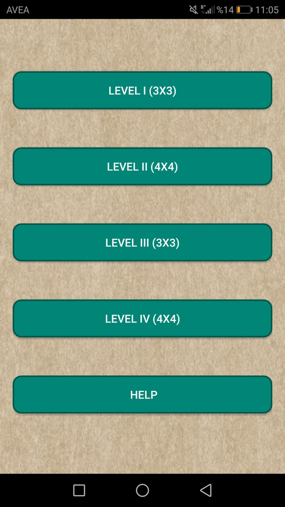
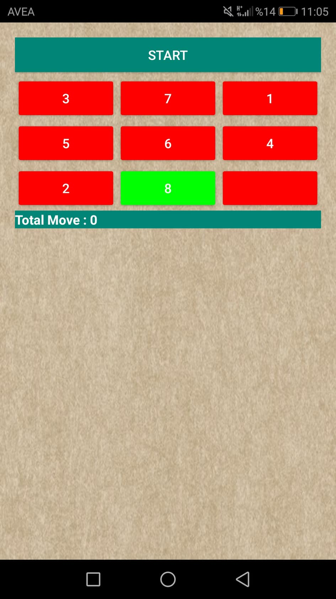
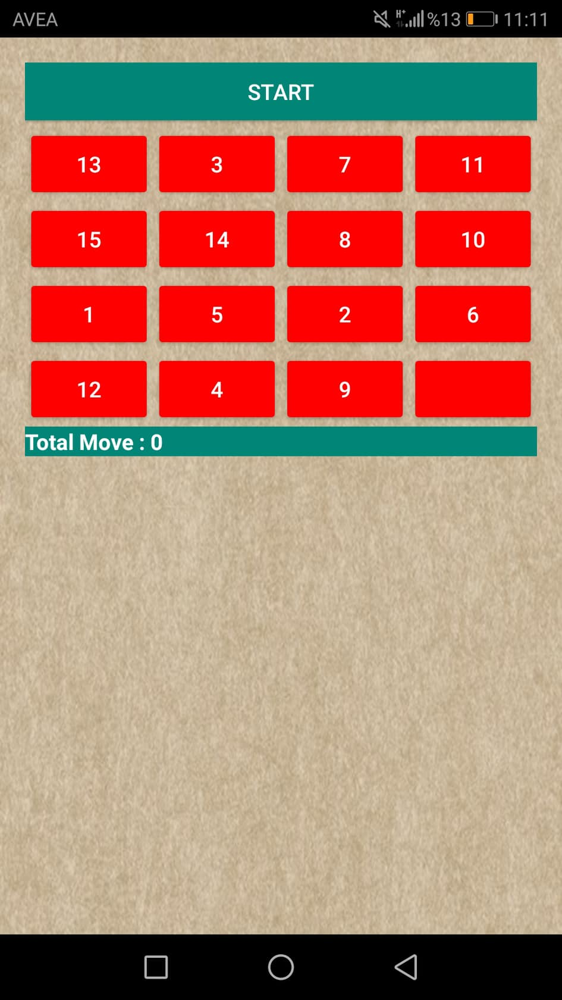
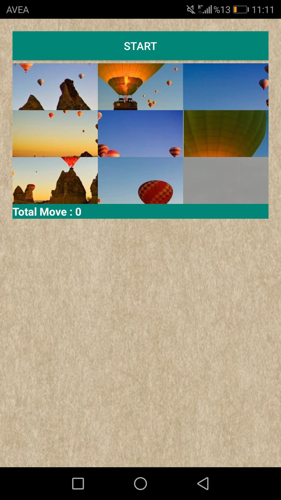
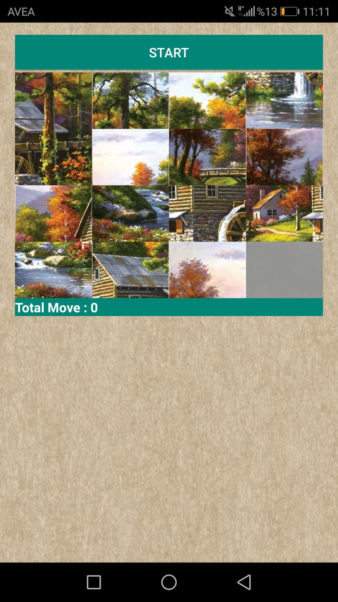

# PictureBoxGame

 Bu oyun zeka geliştirici bir oyun olmakla birlikte ilk iki bölümünde sayıları sıralamayı, son iki bölümde ise puzzle yapmayı amaçlamıştır. 

<h2> Ekran Görüntüleri </h2>

<h3> Menü </h3>

<h3> Level-1 </h3>

<h3> Level-2 </h3>

<h3> Level-3 </h3>

<h3> Level-4 </h3>

<h3> Google Play Store Adresi </h3>

https://play.google.com/store/apps/details?id=com.dilara.gamenumberbox&fbclid=IwAR3vgmeJPtXgm3dEzFr8ahKXb4td6jsgimh5K1lw_9ICu910gyECAEWtaic 

